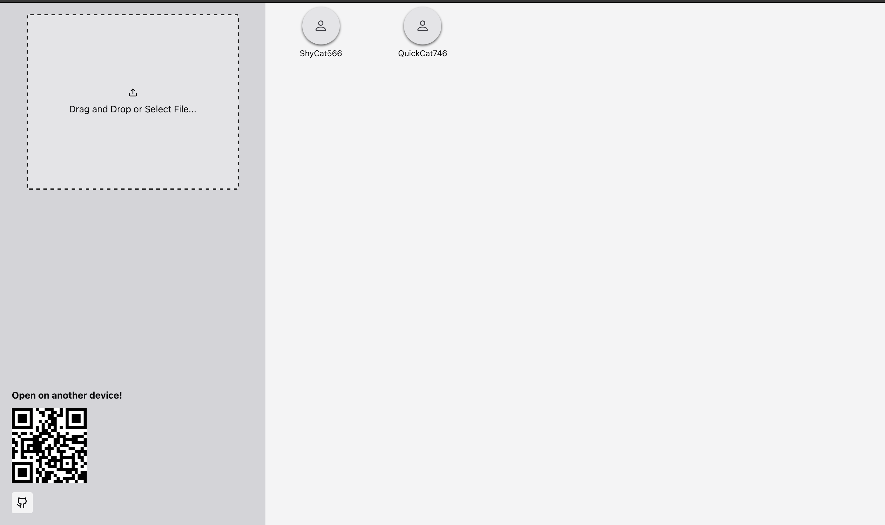
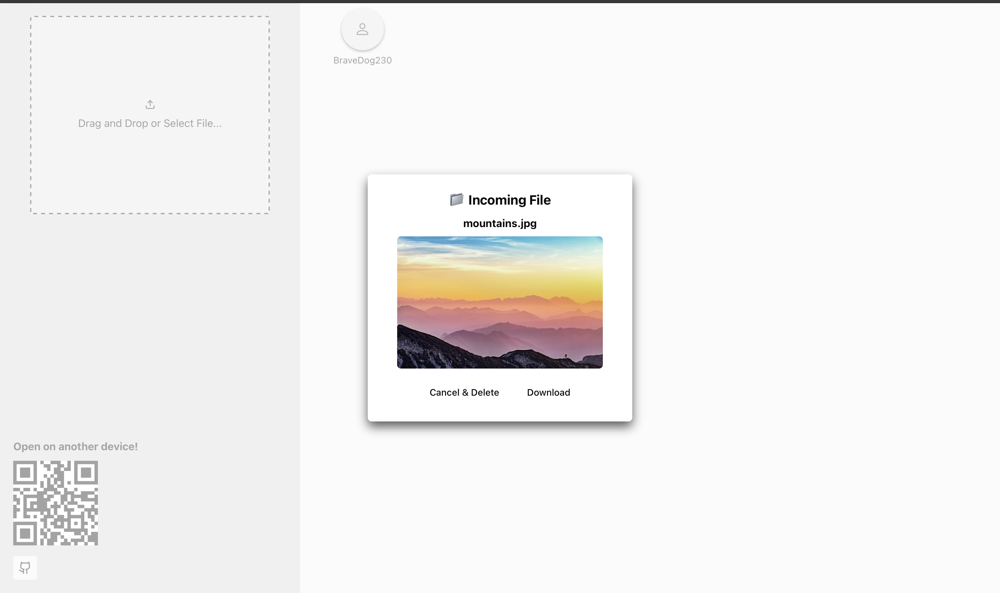

# Local Network File Sharing App

A quick and lightweight peer-to-peer file sharing app over your local network.






## Features

- Drag & drop file uploads
- Real-time device discovery using WebSockets
- Instant downloads via FastAPI endpoints
- Image and file previews (images, zips, PDFs, audio/video)
- Auto-delete files after download
- Scan QR code to connect from mobile
- Clean responsive UI with Chakra UI

## Tech Used

### Frontend:
- [React](https://reactjs.org/)
- [Chakra UI](https://chakra-ui.com/)
- [React Dropzone](https://react-dropzone.js.org/)
- [Axios](https://axios-http.com/)
- [react-qr-code](https://github.com/rosskhanas/react-qr-code)

### Backend:
- [FastAPI](https://fastapi.tiangolo.com/)


## More info:

- Devices announce themselves via WebSocket and appear instantly.
- Uploaded files are found in `app/uploads`
- Recipients get a download preview modal with the option to accept or cancel.
- Files auto-delete after download or cancellation.


## How to Run It

### 1. Running frontend without building
Make sure you are in a Python virtual environment.
```bash
# Set up and activate virtual environment
python -m venv venv
source venv/bin/activate  # On Windows use: venv\Scripts\activate

# Install Python dependencies and run
pip install -r requirements.txt
python run.py
```

### 2. Building frontend
Make sure you are in a Python virtual environment. Also ensure Node.js is installed.
```bash
pip install -r requirements.txt
# Build the frontend
cd frontend
npm install
npm run build
```
Then run `run.py`.
```bash
python run.py
```